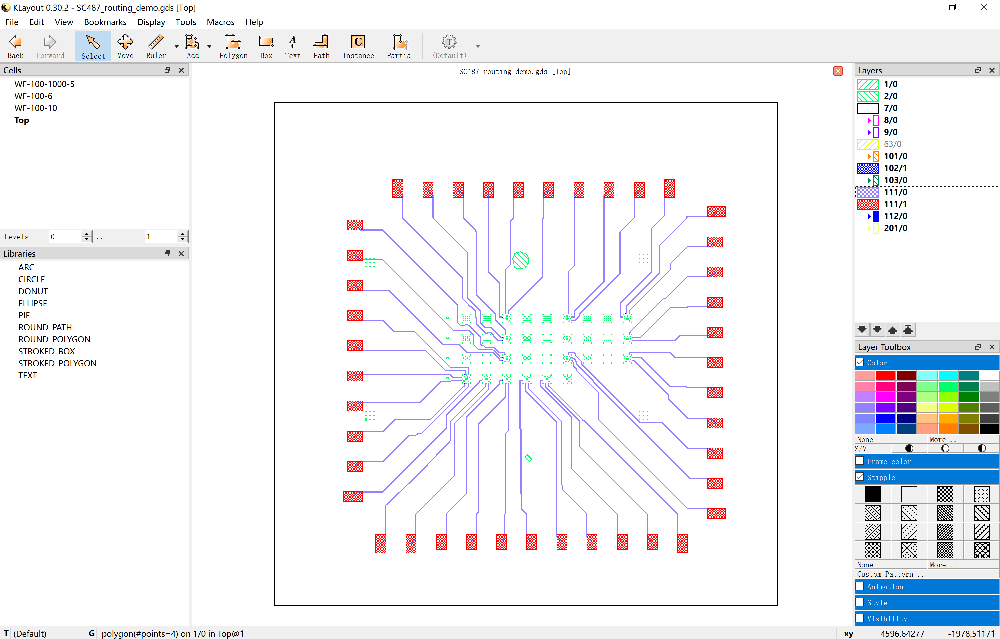
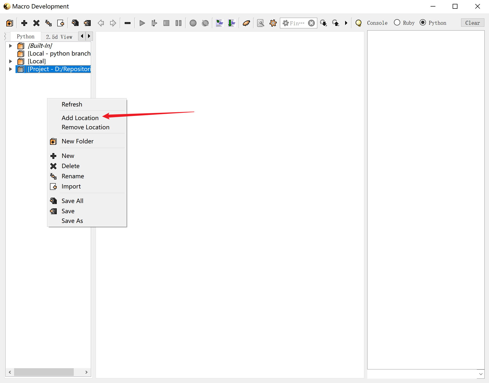

<h1 align="center">Klayout-Router</h1>

<p align="center">
<a href="./Readme_zh.md">中文</a> | English
</p>

**Klayout-Router** is a comprehensive toolkit designed to automate the tedious task of nano-pattern design in Condensed Matter Physics (CMP) experiments.

> **Note:** While named after its core auto-routing capability, this project provides a suite of automation tools (including macros for patching, layer manipulation, etc.) in `./Macros/` .

Unlike industrial circuit design where patterns are highly standardized, laboratory-level nano-device design often requires high customization. Device geometries and contact paths can vary significantly between chips. For a researcher, manually designing every pattern and routing every contact path can be incredibly time-consuming, especially during rapid recipe iteration. **Klayout-Router** aims to solve this by automating tasks like contact routing, patch generation, and defect outlining, saving hundreds of hours of manual labor.

# 🛠Structure

```text
Klayout-Router
├── Auto-routing/           # Core Auto-routing algorithm
│   ├── Krouter.py          
│   ├── Map.py              	
│   ├── PinMatcher.py       	
|   ├── routing.ipynb			# User interface
|   └── requirements.txt        # Pip requirements file
├── Macros/                 # KLayout Macros (Python scripts for KLayout GUI)
│   ├── Auto-patching/      	# Patch generation macro
│   └── Widgets/            	# Utility widgets (layer manipulation, etc.)
└── Readme.md
```

# Table of Contents

- [How to Use the Router?](#how-to-use-the-router)
  - [Requirements](#requirements)
  - [Features](#features)
  - [🔥Quick Start](#🔥quick-start)
- [How to use other Klayout Macros?](#how-to-use-other-klayout-macros)
  - [⚠️Warning](#⚠️warning)
  - [Requirements](#requirements-1)
  - [What's Klayout Macro?](#whats-klayout-macro)
  - [Features](#features-1)
- [License](#license)

# How to Use the Router?

## Requirements

#### System

I build this project on Windows, but it may be feasible on Linux.

#### Environment

Running the Router requires **an independent python/conda environment**, independent from the *Klayout for Windows* software itself. Therefore you don't actually need *Klayout for Windows* to run the router, but you do need it to see what happened to your layout file after you run the router.

1. set up conda environment

   ```bash
   conda create -n klayout_dev python=3.10 -y
   ```
   
2. install requirements

   ```
   conda activate klayout_dev
   cd Klayout-Router/Auto-routing/
   pip install -r requirements.txt
   ```

3. Register ipykernel (necessary for running `.ipynb`)

   ```bash
   python -m ipykernel install --user --name klayout_dev --display-name "klayout_dev"
   ```

#### `.mp4` Rendering

Router supports  `.mp4` rendering for the routing process. But it requires `ffmpeg` (here use **conda install**):

```bash
conda activate klayout_dev
conda install -c conda-forge ffmpeg
```

This is not necessary, an alternative is `.gif` rendering which does not require any other dependencies.

## ✨Features

Klayout-Router automatically routes and connects multiple pairs of pins with `Path` object in the Klayout.

#### Animation demo

On the chip below (with a black box boundary), there are about 50 red large pads on the periphery and 50 blue small pads spread over the core area of the chip. The green patterns are obstacles that need to be avoided when connecting the pads. Here, the size of the chip is $5\text{mm}\times5\text{mm}$; for red big pads it's $200\mu\text m\times100\mu\text m$, and for blue small pads it's $4\mu\text m\times4\mu\text m$.

<figure align="center">
  
  <figcaption> Chip overview </figcaption>
</figure>

Manually connecting these pairs of pads (respectively connect 1 blue pad to 1 red pad) takes over 1hour even for an experienced fab worker like me :) The reason for the huge time consumption is that there are a lot of physical restrictions on the paths distribution:

- Paths cannot cross;
- Paths must be kept at least 1um away from all green patterns (obstacles);
- Paths must be kept away from each other for 20 um, typically;
- There cannot exist any paths within 200 um around the red large pads. This is a customized demand from the recipe in my lab.

With so many restrictions and when the number of pads comes to 50, , the routing task becomes complicated. And people are likely to make mistakes during the process. 

But the router in this project can do this within seconds:

<figure align="center">
  
  <figcaption> Animation of routing process. Restricted to the limitation of fps, the speed of the animation is actually slower than the real routing speed. Without rendering the animation, the routing process usually takes less than 3 seconds on my laptop. </figcaption>
</figure>

This gif is only a animation demo of the algorithm. The resulting paths are inserted into `.gds` file:




#### Behavior of the router

The router does the routing following restrictions below:

1. Paths do not cross.
2. Paths are kept away from obstacles for $x$ um as much as possible.
3. Paths are kept away from each other for  $y$ um as much as possible.
4. Paths are kept away from other pins (except for the pair that it's connecting) for  $z$ um as much as possible.

Here, $x, y, z$ are parameters you can assign as wish. 

But rules No. 2, 3, 4 are treated as **soft constraints**. Sometimes, a solution that strictly satisfies all rules is geometrically impossible. Therefore, the router applies a "cost penalty" mechanism: the closer a path is to an obstacle or another path, the higher the "cost" for that route.

Notice the gradual halo around all paths, obstacles, and pins in the visualization: this halo represents the cost field. This mechanism ensures that even if a perfect solution doesn't exist, the router will find the *best possible* solution rather than simply failing.

#### Semantic segmentation of images


## 🔥Quick Start

After setting up the environment following [Requirements](#requirements)，you can follow `Auto-routing/routing.ipynb` to run the routing demo in `./demo.gds`. Read [technical manual for router](./Auto-routing/manual.md) in `./Auto-routing/` for more details. After understanding the whole pipeline, you can run it on your own file.

# How to use other Klayout Macros?

## ⚠️Warning

The edit on `.gds` file by Klayout Macros is **irreversible**! So make sure you know what you are doing with these macros or backup your file before using.

The author shall not be liable for any data loss or layout damage resulting from the use or misuse of this project (including its scripts and macros).

## Requirements

Klayout Macros run completely in *Klayout Macro Development* inside *Klayout* software. Download the latest version of [KLayout Layout Viewer And Editor](https://www.klayout.de/build.html) to run them without setting up python environment.

System: Windows is preferred, MacOS and Linux are not guaranteed.

## What's Klayout Macro?

Macros are scripts in Ruby or Python.

Where to find Macro development:

> Open Klayout GUI $\to$ Macros $\to$ Macro development $\to$ Python $\to$ Add location (right click on the blank area) $\to$ Select `/Klayout-Router/Macros/`

Check [KLayout Macro Development](https://www.klayout.de/doc/about/macro_editor.html) for more information. 



## Features

### Auto-patching

This macro addresses a specific requirement in our lab, so its function might seem unusual. It can **put a `Box` at every intersecting point between patterns and a grid**.

> Detailed description: Given the layer of electrodes and the layer of the grid, it will automatically generate a square box with width $d$ , on the `patch layer`, at every intersecting point between the grid and the electrodes. What's more, it will also keep the intersection between the electrodes and an extended grid (the same grid but with width $d$)

Notice: **the grid must be edges of some boxes or polygons.** The script identifies the grid by extracting the edges of these polygons or boxes. So you must put boxes or polygons on the `grid layer`.

Usage:

1) Open KLayout → Macro Development.
2) Load `./Macros/Auto-patching/run_patch.py` and run it (click **the green triangle with an exclamation on it**).
3) In the dialog, set the Electrode layer, Writing Field layer, Patch layer (where to put patches), and Patch size (µm).
4) Click `Create Patches` and check the Patch layer.

<figure align="center">
  
  <figcaption> Demonstration of Auto-patching in Klayout Macro </figcaption>
</figure>

> **Why such a specific function?**
>
> This is a highly customized demand. In (our) EBL system, the maximum writing field (WF) is only 1mm$\times$1mm, but the size of the whole chip is 5mm$\times$5mm! This means the whole chip pattern has to be divided into 25 pieces to be exposed separately. This will induce positioning error at the edges of the WF, and the exposed patterns on the real resist may not connect at the WF edges. So we need to add patches at each intersection between the patterns and the WF edges, and specially expose this patch layer with a different writing field setting to ensure all these patches will not intersect with the WF. This method can fix the disconnection problem. But this method is really stupid and full of compromise compared to industrial lithography with light.

### Other Widgets

There are some more automation widgets in `./Macros/Widgets/` which can help you reduce a lot of mouse clicking on the GUI. 

- `change_layer.py`: Move shapes from one or more source layers to a target layer (optionally clearing the original layers).
- `change_layer_by_overlapping.py`: Move shapes from source layers to a destination layer only if they geometrically overlap shapes on a reference layer.
- `change_path_width.py`: Modify the width of `Path` shapes on selected layers.
- `clear_layer.py`: Delete/clear all shapes on specified layers in the current cell/layout.
- `merge_layer.py`: Merge shapes on multiple layers.

Usage is as above, and all operations will be done on the currently viewing layout.


# License

This project is licensed under the MIT License.

Copyright (c) 2025 Legendrexial

Permission is hereby granted, free of charge, to any person obtaining a copy
of this software and associated documentation files (the "Software"), to deal
in the Software without restriction, including without limitation the rights
to use, copy, modify, merge, publish, distribute, sublicense, and/or sell
copies of the Software, and to permit persons to whom the Software is
furnished to do so, subject to the following conditions:

The above copyright notice and this permission notice shall be included in all
copies or substantial portions of the Software.

THE SOFTWARE IS PROVIDED "AS IS", WITHOUT WARRANTY OF ANY KIND, EXPRESS OR
IMPLIED, INCLUDING BUT NOT LIMITED TO THE WARRANTIES OF MERCHANTABILITY,
FITNESS FOR A PARTICULAR PURPOSE AND NONINFRINGEMENT. IN NO EVENT SHALL THE
AUTHORS OR COPYRIGHT HOLDERS BE LIABLE FOR ANY CLAIM, DAMAGES OR OTHER
LIABILITY, WHETHER IN AN ACTION OF CONTRACT, TORT OR OTHERWISE, ARISING FROM,
OUT OF OR IN CONNECTION WITH THE SOFTWARE OR THE USE OR OTHER DEALINGS IN THE
SOFTWARE.

